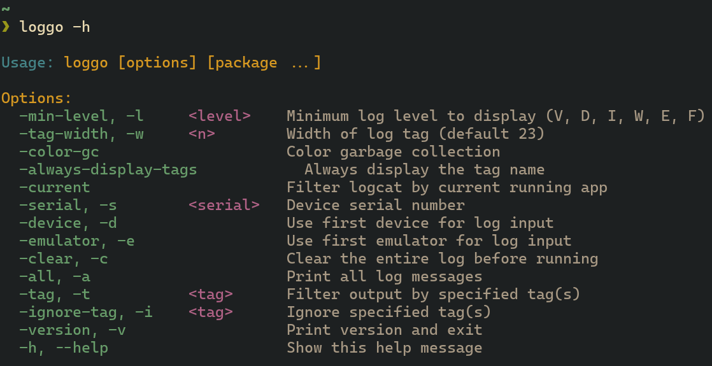
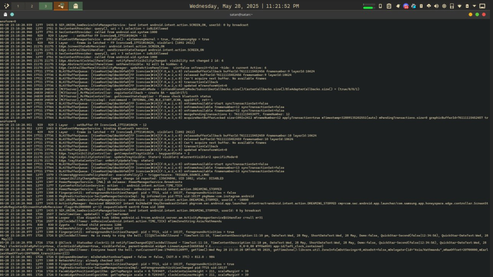
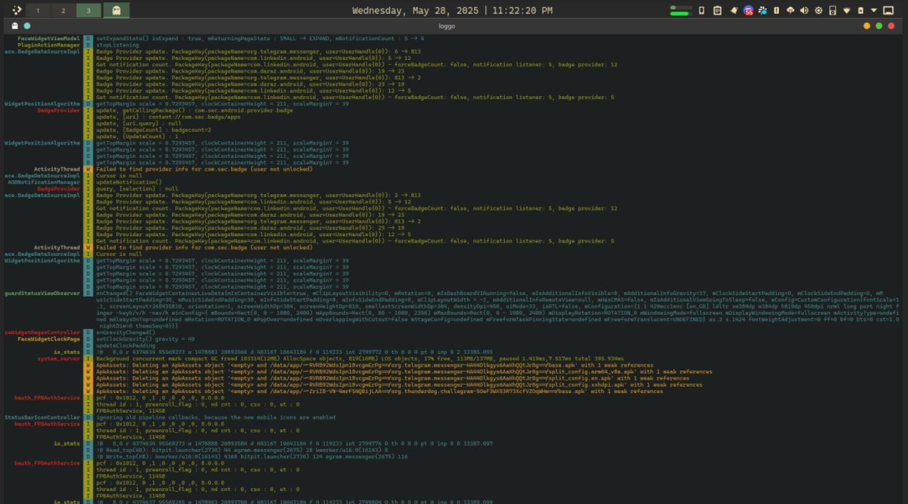

# Loggo

`loggo` is an Android logcat wrapper that:

- Filters Android logs by package names, log levels, and devices
- Colorizes output with different colors for log levels, tags, and messages
- Formats logs with proper alignment and wrapping
- Tracks processes - shows when apps start/stop with highlighted notifications

## Comparison

| before                         | after                        |
| ------------------------------ | ---------------------------- |
|  |  |

## Key Features

Command Line Options (from config.go):

- `--min-level, -l`: Filter by minimum log level (V, D, I, W, E, F)
- `--tag-width, -w`: Set width of the tag column for alignment
- `--current`: Filter logs for currently running app only
- `--device, -d` / `--emulator, -e`: Choose between USB device or emulator
- `--serial, -s`: Specify device by serial number
- `--version, -v`: Show version info

## TOOO

- [ ] interactive mode
- [ ] status bar for available keypress
- [ ] live filtering in interactive mode
- [ ] select log levels in interactive mode
